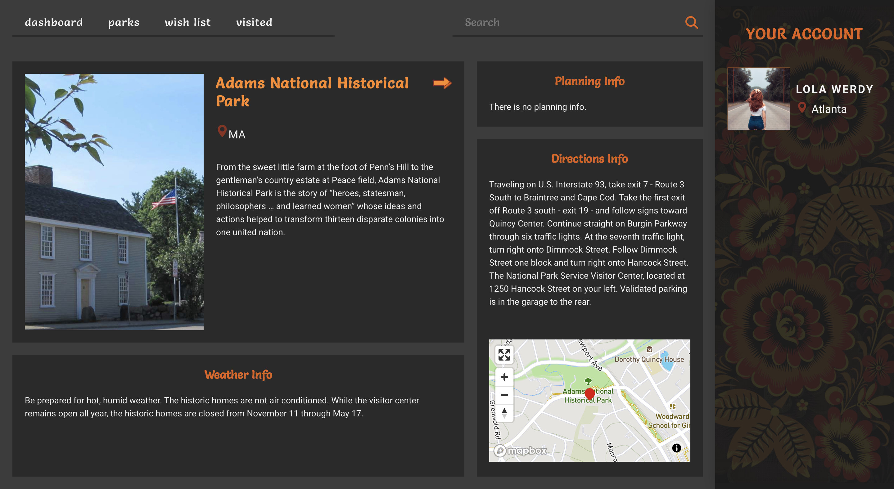

# National Park Tracker

## Author (code & design)

[Raisa Primerova](https://github.com/RayRedGoose)

## Overview

NPtracker is a system with National Parks information. The app purpose is to track how many parks was visited and when or to plan visit to it.

## Setup

Deployed app: [click here to see](https://rayredgoose.github.io/NPTracker)

Download to local machine:

- `clone` the repo to your local machine

- run `npm install` to download all necessary dependencies

- run `npm start` to run the server

NOTE! For deployed app limited requests API key was used.
To see correct working app clone done and use your own api key in apiCalls file.

## Design

**Welcome Page**

**Sign Up Page**

**Login Page**

**All Parks Page**

**Single Park Page**

**Wish list Page**

**Loading Image**

